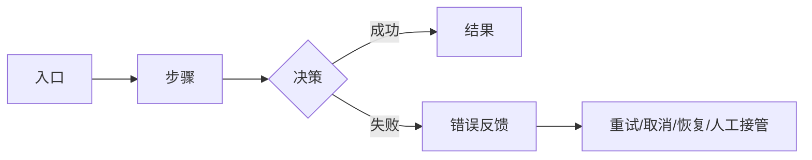

# S2 竞品研究结构物模板（与三份飞书报告配套）

> 使用方法：以下每个一级标题分别保存成标题注明的文件；`<...>` 是占位符，交付前必须实填、
> 改为“明确未知/TBD+owner”或“N/A+理由”。三份面向读者的报告用 `research-report.md`；
> 本模板保存可比较、可追溯、可被机器检查的结构物，避免飞书摘要成为下一阶段唯一输入。

---

# `competitor-landscape.md` · 竞品双轴全景

## 研究合同

| 字段 | 内容 |
|---|---|
| `DECISION` | <谁要决定什么> |
| `QUESTION` | <主问题 + 3–5 子问题> |
| `CHANGE-MIND` | <什么证据会改变当前判断> |
| `SCOPE` | 地区/语言/端/版本/价格档/用户段/截止日期 |
| `DEPTH` | 全景/档案/深挖分配及理由 |
| `AI-SCOPE` | 适用/不适用 · 理由：<...>；适用时核心/辅助/增值 |
| `ACCESS-PLAN` | Web 浏览器 / macOS Computer Use / 仅资料 / 不可访问；授权与副作用边界 |
| `POSITIONING-LENS` | 目标用户/价值主张/不服务谁/差异化的待验证假设；来源 `S1-xx` |
| `STRATEGIC-TENSION` | `<选择标准 A> ↔ <选择标准 B>`；为什么是用户真实选择标准：`CLM-xxx` |
| `SOURCE-PLAN` | 各承重维度的一手来源、独立复核、实测通道与降级方式 |

## 候选池与剪枝记录

> 默认先找 10–18 个候选，再收敛到 8–12 个正式档案和 3–5 个深挖对象；
> `scope.md` 可调整数量并说明理由。威胁价值与学习价值分列，⛔ 不合成总分。

| CAND | 对象/入口 | 竞争关系 | 用户/购买者/任务重叠 | 形态/地区/档位 | 威胁价值+理由 | 学习价值+理由 | 纳入/排除/观察 | 排除理由/重看触发 | CLM |
|---|---|---|---|---|---|---|---|---|---|
| `CAND-01` | | | | | 高/中/低/未知+理由 | 高/中/低/未知+理由 | | | `CLM-xxx` |

## 按维度取证计划

| 决策维度 | 首选一手证据 | 独立复核 | 交互实测 | 拿不到时的降级 |
|---|---|---|---|---|
| 功能/流程/状态 | | | Web 浏览器 / 获授权的 macOS Computer Use / Electron 壳 CDP 直读 | 按降级阶梯逐级降（CDP、AX、截图、本地痕迹、`[宣称]`），每级写明上一级为何不可用 |
| 定价/商业/增长 | | | 只观察权限内升级触发，不擅自购买/制造互动 | |
| 视觉/交互 | | | 多端、多状态、同任务截图/录屏/量测 | 静态图不推断动效与恢复 |
| 技术/AI/数据/合规 | | | 同输入/难例/失败测试（权限内） | 宣称/推断/未知分开 |

## 双轴竞品集合

| COMP | 对象/入口 | 竞争关系 | 问题重叠 | 用户/购买者重叠 | 预算/流程重叠 | 样本角色 | 深度档 | 选择理由 | 证据 |
|---|---|---|---|---|---|---|---|---|---|
| `COMP-01` | | 直接竞品/间接竞品/替代方案/潜在进入者 | | | | 品类头部/直接对手/越级参照/反面样本 | | | `CLM-xxx` |
| `COMP-alt` | <人工凑合 / 通用工具 / 脚本·CLI / 干脆不做> | **替代** | | | | **反面样本** | — | ⭐ 用户明天不用我们会改用什么；若当前用户自己就在用，注明 | `CLM-xxx` |

## 采集通道与授权

> 本表是**采集计划**；执行事实的唯一回执写在 `key-flows.md#实测采集回执`，
> 单体档案只引用 `RUN-xx`，避免计划、档案和报告形成三个会漂移的真源。

| RUN | COMP | 产品形态 | 采集通道 | 版本/价格档 | 授权状态与日期 | 测试账号/数据 | 外部副作用边界 | 证据目录 |
|---|---|---|---|---|---|---|---|---|
| `RUN-01` | `COMP-01` | Web/macOS 原生/Electron 壳/其他 | web-browser/mac-computer-use/cdp-direct/retrieval-only/inaccessible | | 用户已授权下载与操作 YYYY-MM-DD / 已安装且授权操作 YYYY-MM-DD / 无需下载授权 / 未授权未下载 | 测试账号+合成数据 | 不付费/不发布/不发送/不删除/不改真实账号/不新增系统权限/不代签任何协议 | `raw/<slug>/<date>/` |

## 类别覆盖与未发现

| 类别 | 代表对象 | 若无：检索范围/关键词/日期 | 未发现的影响 | 下一次复查触发 |
|---|---|---|---|---|
| 直接竞品 | | | | |
| 间接竞品 | | | | |
| 替代方案 | | | | |
| 潜在进入者 | | | | |
| 品类头部 | | | | |
| 直接对手 | | | | |
| 越级参照 | | | | |
| 反面样本 | | | | |

## 需求侧竞品

| 替代/凑合方式 | 用户任务 | 它实际上更好的地方 | 切换成本/惯性 | 证据 |
|---|---|---|---|---|
| | | | | `CLM-xxx` |

---

# `<竞品名>.md` · 单体档案

## 身份与快照

- `COMP-xx`：
- 官网/入口：
- 竞争关系 / 样本角色 / 深度档：
- 地区/语言/端/版本/价格档：
- 产品形态 / 采集通道 / `RUN-xx`：
- 授权回执：<引用 `key-flows.md#RUN-xx`；不在此复制授权原文>
- 采集日期 / 最近更新：
- 原始材料索引：`raw/<slug>/<YYYY-MM-DD>/`

## 定位、用户与场景

| 项 | 原文/事实 | 分析 | CLM |
|---|---|---|---|
| 核心痛点/品类/承诺结果 | | | |
| 目标用户/购买者/管理员/不服务谁 | | | |
| 核心场景/JTBD/选择标准 | | | |
| 差异化宣称与理由/证明 | | | |

## 能力、价格、商业与增长

| 项 | 事实 | 完成质量/结果 | 取舍/影响 | CLM |
|---|---|---|---|---|
| 基础/核心/次要/特色能力 | | | | |
| 价格/档位/限额/升级与退出成本 | | | | |
| 获客/销售/实施/服务/生态 | | | | |
| 激活/留存/协作/网络效应/流失信号 | | | | |

## ⭐ 与我们 PRD 同构的载体产出（分档见 `competitive-research.md` **2.3a**）

> **全员档（每个"可读"的正式竞品都必填）**：① 核心体验路径 · ③ 产品模块图 · ④ 功能清单 · ⑥ 页面关系图
> **深挖档（3–5 个）再加**：② 关键流程图 · ⑤ 功能架构图 · ⑦ 设计交互（见下方专节）·
> ⑨ 权限矩阵 · ⑩ 产品级安全可见面 · ⑪ 字段规格 · ⑫ 状态覆盖 · ⑬ 技术路线 · ⑭ NFR 观察
> ⛔ 取证够不着的竞品标 `[阻断]` 并走 3.3 降级阶梯，**不许用 `[宣称]` 拼出一份看起来完整的产出**。
> ⛔ ID 用竞品族 `CM-xx` / `CAF-xxx` / `CP-xx`，**不许用我们的 `M-xx` / `F-xx` / `P-xx`**——
> 混进去后两边的追溯链永远分不开。图源一律 `.d2`/`.mmd`/`.puml`，⛔ 截图不能替代。

### ① 核心体验路径（对应我们 PRD 4.4）

图源：`<竞品名>/core-path.d2`

`<步骤1（动词）>` → `<步骤2>` → `<步骤3>` → `<步骤4>`

- 这条路走不通它就不成立的那 4 个动词是：<……>
- 与**我们**的核心体验路径差在哪一步：<……>

### ② 产品模块图（对应我们 PRD 6.1）

图源：`<竞品名>/module.d2`　顶层分组方式：<业务域 / 行业三层>

| `CM-xx` | 模块名 | 属于哪个分组 | 它在这个产品里的**重心程度** | 证据 |
|---|---|---|---|---|
| `CM-01` | | | 核心 / 次要 / 边缘 | `CLM-xxx` |

### ③ 功能架构图 / 功能树（对应我们 PRD 6.2）

图源：`<竞品名>/feature-tree.d2`　拆的是哪 1–2 个关键模块：`CM-xx`

> ✅ 验收：任何一个叶子，研发问"具体怎么做"你不需要再解释第二遍。
> ⛔ 叶子写成"排序功能"这种同义反复 = 没拆完。

### ④ 功能清单（`CAF-xxx`，喂 `matrix.md` 同分母长表）

| `CAF-xxx` | 功能名（动词短语） | 所属 `CM-xx` | 端 | 价格档 | 完成质量/上限 | 证据标记 | 映射到我们的 `AF-xxx` |
|---|---|---|---|---|---|---|---|
| `CAF-001` | | `CM-01` | 两端/仅web/仅移动 | 免费/Pro | | `[实测·通道·日期]` | `AF-001` / **无对应（机会点）** |

## 关键任务、视觉与交互

| FLOW/画面 | 同口径结果 | 状态/失败/恢复 | 视觉/交互机制 | 截图/录屏/CLM |
|---|---|---|---|---|
| `FLOW-01` | 成败/步骤/耗时/等待/回退/错误 | | | |

### ⭐ 交互与动效对比（**必填**；⛔ "丝滑/高级/直观"不是证据）

> 每格要么是实测描述，要么写 `未获取 + 原因`。动效只写**量级档**，
> ⛔ 除非真的逐帧量过并写明方法，否则不要谎称精确毫秒。

| 对比字段 | `CAF-xxx`/画面 | 实测描述 | 证据 |
|---|---|---|---|
| 页面转场 | | <方向/层级，如"从下向上覆盖，返回原路退出"> | 录屏锚点 |
| 反馈形态 | | <Toast/内联/阻塞弹窗/静默；何时出现、何时消失> | |
| 动效量级 | | <瞬时 \<100ms / 短 100–200ms / 中 200–400ms / 长 \>400ms + 量法> | |
| 空 / 错 / 加载态 | | <有没有、长什么样、给不给出路> | |
| 键盘与无障碍 | | <仅键盘可达、焦点环、读屏语义、对比度> | |
| 手势与命中区（移动端） | | <长按/滑动/拖拽；命中区是否 ≥44pt> | |
| AI 人机交接 | | <低置信时界面怎么表现、转人工入口在哪、接手方看到什么> | |

## 功能遍历覆盖账

> 这是“发现功能”的原始枚举账，不是挑几个亮点填写的功能清单。先遍历导航、菜单、工作区、
> 创建/导入、搜索/筛选、详情、批量操作、协作、通知、设置、账号/组织/角色权限、帮助、快捷键、
> 定价/档位、空态/错误态/升级入口，再逐项操作。一个页面有三个可观察动作，就至少写三条 `SURF`；
> 同一动作在角色、端、档位、前置、默认值、成功/失败结果或恢复方式上不同，也分行记录。
>
> 每个 `SURF-xxx` 必须且只能得到一种处置：① 归并到一个或多个已有 `AF-xxx`；② 新建 `AF-xxx`
> 并回填全部正式竞品；③ `NON-FEATURE + 排除理由`；④ `BLOCKED + 阻断范围/补证计划`。
> 没实际走到结果不得标 `[实测]`；只可写 `[仅观察]`、`[宣称]`、`[阻断]` 或 `未获取+原因`。

| SURF | RUN | 一级模块 | 页面/区域/入口 | 用户可见动作/结果（最小颗粒） | AF 归并/处置 | 已打开 | 已实际操作 | 状态/失败/恢复 | 结果标签 | 截图/录屏/CLM 证据 | 未覆盖/排除理由 |
|---|---|---|---|---|---|---|---|---|---|---|---|
| `SURF-001` | `RUN-01` | 文件管理 | 列表/行菜单/重命名 | 修改单个对象名称；成功后列表立即显示新名称 | `AF-001` | 是 | 是 | 冲突时保留原名；可重试/取消 | `[实测·web-browser·日期]` / `[实测·mac-computer-use·日期]` / `[仅观察]` / `[宣称]` / `[阻断]` | `CLM-xxx` + 截图/录屏锚点 | N/A：已覆盖 |
| `SURF-002` | `RUN-01` | 帮助 | 更新日志/营销横幅 | 仅展示版本宣传，不产生可独立验收的产品状态变化 | `NON-FEATURE` | 是 | 否 | N/A：纯内容展示 | `[仅观察·日期]` | `CLM-xxx` | 排除：不是可执行产品能力 |
| `SURF-003` | `RUN-01` | 管理后台 | 组织设置/企业功能 | 入口可见但需企业管理员与付费档，结果未知 | `BLOCKED` | 是 | 否 | 付费墙阻断；申请试用后补测 | `[阻断·日期]` | `CLM-xxx` | 阻断范围+`TBD-xxx`+owner+补证日期 |

## 技术、数据、安全与合规

| 项 | 只写可验证事实 | 对体验/壁垒的影响 | CLM |
|---|---|---|---|
| 性能/稳定/并发/离线/兼容/集成/迁移 | | | |
| 数据来源/权限/保留删除/隐私/认证/地域监管 | | | |

## AI 专项

> `AI-SCOPE=不适用` 时：`N/A + 理由`。适用时填写全部行。

| AI 维度 | 事实/同口径实测 | 失败与边界 | CLM |
|---|---|---|---|
| 能力角色与技术权重 | | | |
| 能力矩阵与人工复核 | | | |
| 效果质量与用户纠正 | | | |
| 门槛、信任、解释与反馈 | | | |
| 延迟、取消、重试、降级、人工接管 | | | |
| 数据/标注/评测/偏差/漂移 | | | |
| 路线/模型家族/编排/可替换性 | | | |
| 单位成本/配额/峰值 | | | |
| 安全/版权/隐私/审计/地域 | | | |

## 取舍与轨迹

| 做/不做/变化 | Can't/Won't/TBD | 为什么 | 日期 | CLM |
|---|---|---|---|---|
| | | | | |

## 强项、弱项与最强版本

- 它最强的地方及证据：
- 用户赞扬/投诉的复现模式：
- 对它最有利的上下文：
- 什么情况下不应把它作为参照：

---

# `matrix.md` · 竞品横向矩阵

`AI-SCOPE：适用/不适用 · 理由：<...>`

## 公共维度矩阵

| 维度 | 我们/目标 | COMP-01 | COMP-02 | 统一口径 | 判读/证伪条件 |
|---|---|---|---|---|---|
| 定位与价值主张 | | | | 原文/推断分开 | |
| 目标用户与购买者 | | | | 使用者/购买者/管理员 | |
| 核心场景/JTBD | | | | 触发—进展—替代—选择标准 | |
| 关键流程 | | | | 同一任务/输入/完成定义 | |
| 核心能力与覆盖度 | | | | 形态/质量/端/价格档 | |
| 版本与迭代节奏 | | | | 近 12 个月 | |
| 价格与包装 | | | | 计费/限额/升级/退出成本 | |
| 商业化与服务 | | | | 获客/销售/实施/服务/生态 | |
| 增长与留存 | | | | 激活/留存/赢败单/渠道 | |
| 用户体验 | | | | 可学/效率/反馈/恢复/无障碍 | |
| 视觉与品牌 | | | | 构图/token/组件/内容/签名动作 | |
| 技术底层 | | | | 影响体验/壁垒的性能稳定兼容集成 | |
| 数据/安全/合规 | | | | 权限/保留删除/隐私/地域监管 | |
| 未登录/未付费档可见面 | | | | 登录墙/协议墙出现在第几步；零可见=产品决定 | |

## 功能矩阵

> 本表只做快速阅读投影；行集与详细事实以 `atomic-feature-ledger.md` 为唯一正本。
> 每行必须是 `AF-xxx`，不得把模块名、页面名或“AI 助手/高级搜索/协作”等能力包当一行。

| AF | 功能层 | 原子功能/任务结果 | 我们/目标 | COMP-01 | COMP-02 | 判读/证伪条件 |
|---|---|---|---|---|---|---|
| `AF-001` | 基础/核心/次要/特色 | <一个角色+一个触发+一个动作+一个主要结果> | | `FULL · [实测·日期] · 形态/质量/端/档位 · 见原子账本` | `UNKNOWN · 阻断+TBD/owner · 见原子账本` | 基线/新势/伪需求待证 |

## 竞品有而我们没有的

| 做法 | 对象 | 解决的问题/结果 | 为什么清单原来没想到 | 借鉴/规避/差异化候选 | CLM |
|---|---|---|---|---|---|
| | | | | | |

## AI 专项矩阵

> 不适用时保留：`N/A + 理由`。适用时覆盖角色/能力/效果/门槛/失败/数据评测/路线/成本/合规。

| AI 维度 | 我们/目标 | COMP-01 | COMP-02 | 同口径证据 | 判读/证伪条件 |
|---|---|---|---|---|---|
| AI 能力角色与技术权重 | | | | | |
| AI 能力矩阵 | | | | | |
| 效果质量 | | | | | |
| 使用门槛与信任 | | | | | |
| 响应、失败、降级与人工接管 | | | | | |
| 数据与评测 | | | | | |
| 技术路线与壁垒 | | | | | |
| 单位成本与规模 | | | | | |
| 安全与合规 | | | | | |

---

# `atomic-feature-ledger.md` · 原子功能账本与横向比较正本

> **先拆原子、再做事实长表、最后生成横向矩阵。** 不允许从各竞品的纵向介绍直接拼一张宽表。
> 新发现一个 AF 后，必须给全部正式 `COMP-xx` 补齐状态；没有操作到不能写 `FULL`。

## 功能分解合同

| 项 | 本轮声明 |
|---|---|
| 比较全集 | 我们已知功能 ∪ 各竞品 SURF 账归并/新建功能 ∪ 正式竞品其他证据发现功能 ∪ 需求侧替代方案中影响同一结果的做法 |
| 原子停止规则 | 可独立发现/启停/授权/定价/验收/失败/差异化；再往下仅是内部实现且不改变可观察行为时停止 |
| 必须再拆 | 多角色/多触发/多动作/多主要结果/多状态变化，或竞品只能实现其中一半 |
| 不机械拆 | 字段、按钮、技术步骤只有在独立改变规则/状态/结果/验收时才升为 AF |
| 状态枚举 | `FULL / PARTIAL / ABSENT / UNKNOWN / N/A` |
| 版本边界 | 地区 `<...>` · 端 `<...>` · 版本 `<...>` · 价格档 `<...>` · 截止日期 `<YYYY-MM-DD>` |

## 功能分解词典

> 原子陈述必须能连成一句：角色在场景/入口/触发下，对对象/输入按前置/规则执行一个动作，
> 产品产生一个主要状态变化，用户看到一个可观察结果。任一格包含两个可独立验收项就继续拆。

| AF | 功能路径 | 层级深度 | 父节点 | L0 用户进展/JTBD | L1 业务域/一级模块 | L2 能力族 | 角色 | 场景/入口/触发 | 对象/输入 | 前置/规则 | 单一动作 | 主要状态变化 | 可观察结果/完成定义 | 独立验收点/拆分说明 |
|---|---|---:|---|---|---|---|---|---|---|---|---|---|---|---|
| `AF-001` | `<L0> / <L1> / <L2> / <实际继续下钻节点> / AF-001` | <实际深度> | <直接父节点 ID/名称> | <用户最终进展> | <模块> | <能力族> | <角色> | <一个触发> | <对象> | <规则> | <一个动词> | `<from> → <to>` | <一个主要结果+可判定阈值> | <为何到此停止；相邻 AF 是什么> |

## 原子功能事实账

> 每个 `AF-xxx × COMP-xx` **恰好一行**。`ABSENT` 写已检索入口/范围/日期；
> `UNKNOWN` 写阻断、影响、`TBD-xxx` 与 owner；`N/A` 写理由。字段确实不适用时也写 `N/A+理由`，不得留空。

| AF | COMP | 状态 | 入口/触发 | 字段/参数/默认值 | 规则/前置 | 状态变化 | 结果/反馈/文案 | 失败/恢复 | 权限/端/档位/限额 | 质量/效率/用户代价 | 证据标签+日期 | RUN/CLM | 差异判读/Can't-Won't-TBD |
|---|---|---|---|---|---|---|---|---|---|---|---|---|---|
| `AF-001` | `COMP-01` | `FULL` | <真实入口+触发> | <字段/参数/默认值，或 N/A+理由> | <规则/前置> | `<from> → <to>` | <可观察结果+反馈原文> | <失败条件+重试/取消/回退> | <角色权限+端+价格档+限额> | <步骤/耗时/成功质量/学习等待切换代价> | `[实测·web-browser·YYYY-MM-DD]` | `RUN-01 / CLM-001` | <为何同/异；Can't/Won't/TBD> |
| `AF-001` | `COMP-02` | `ABSENT` | 已检索：导航/设置/帮助/定价页 | N/A：范围内未发现 | <检索版本/档位/端> | N/A：未发现能力 | 范围内未发现，不声称绝对没有 | <若发现新入口则重开> | <已查范围> | 未获取 | `[检索后未发现·YYYY-MM-DD]` | `CLM-002` | TBD：可能受档位限制 |

## 横向对比面板

> 飞书每个面板建议最多 3–4 个竞品列。**只拆列、不删行**；所有面板复用同一 AF 行集、定义和顺序。

### PANEL-01 · COMP-01—COMP-04

| AF | 原子功能定义 | 我们/目标 | COMP-01 | COMP-02 | COMP-03 | COMP-04 | 横向结论/证伪条件 |
|---|---|---|---|---|---|---|---|
| `AF-001` | <与词典完全一致> | <目标/不做+理由> | `FULL · 见事实账` | `ABSENT · 见事实账` | `PARTIAL · 见事实账` | `UNKNOWN · 见事实账` | <结果/代价/取舍；什么会推翻> |

## 横向对比面板清单

| PANEL | 覆盖竞品 | AF 首尾 | AF 数量 | 与词典行集一致 | 重复/遗漏 | 校验人/日期 |
|---|---|---|---:|---|---|---|
| `PANEL-01` | `COMP-01—COMP-04` | `AF-001—AF-0xx` | `<N>` | 是 | 无 | <owner/YYYY-MM-DD> |

## 逐级横向对比

> 从每条 `功能路径` 的根节点逐层写到最细功能的直接父节点；不同分支可以有不同深度。
> 每个节点汇总其全部子 AF，不能只挑好写的功能；最细功能差异仍以横向面板和事实账为准。

| 节点路径 | 层级深度 | 父节点 | 子 AF 全集 | 各竞品覆盖边界 | 共同模式 | 关键差异与原因 | 用户/业务代价 | 对我方下游输入 |
|---|---:|---|---|---|---|---|---|---|
| `<根任务>/<当前节点>` | <实际深度> | <根/N-A 或父路径> | `AF-001/AF-002` | <逐竞品说明，不写各有优劣> | <事实共性> | <同口径差异+Can't/Won't/TBD> | <步骤/等待/学习/风险> | <PRD/设计/技术/测试> |

## 原子功能下游映射

| AF | 研究结论 | PRD `FR/NFR/AC` | Figma 画面/组件/状态 | HTML `flow/scene/state/operation` | adopt/adapt/reject/defer/watch | 验证指标/证伪条件 |
|---|---|---|---|---|---|---|
| `AF-001` | <基线/借鉴/规避/差异化> | `FR-xxx / AC-x` 或 `WATCH/N/A+理由` | <锚点或 WATCH/N/A+理由> | <锚点或 WATCH/N/A+理由> | <一种+理由> | <同任务指标+阈值> |

---

# `key-flows.md` · 关键流程对比

## 实测采集回执

> 这里是每次采集的**执行事实唯一正本**。计划写在 `competitor-landscape.md`，三份飞书报告与单体档案只引用本行。

| RUN | COMP | 产品形态 | 采集通道 | **通道可达性** | 执行日期 | 版本/账号/价格档 | 官方来源/入口 | 授权状态与日期 | 测试数据 | 外部副作用边界 | 功能覆盖账 | 结果标签 | 截图/录屏目录 | 阻断/降级理由 |
|---|---|---|---|---|---|---|---|---|---|---|---|---|---|---|
| `RUN-01` | `COMP-01` | Web/macOS 原生/Electron 壳/其他 | web-browser/mac-computer-use/cdp-direct/retrieval-only/inaccessible | 敞开/AX完整/剥target/反调试/不适用/未量（判据见 **3.8.1**；⛔ `未量`≠`反调试`） | YYYY-MM-DD | | https://official.example | 无需下载授权 / 用户已授权具体产品+版本+官方来源 YYYY-MM-DD / 已安装且授权操作 YYYY-MM-DD / 未授权未下载 | 测试账号+合成数据 | 不付费/不发布/不发送/不删除/不改真实账号/不新增系统权限/不代签任何协议 | `<竞品档案>#功能遍历覆盖账` | `[实测·web-browser·日期]` / `[实测·mac-computer-use·日期]` / `[实测·cdp-direct·日期]` / `[宣称]` / `[公开演示]` / `[阻断]` | `raw/<slug>/<date>/` | 无阻断 / <具体原因+影响> |

> macOS 的 `mac-computer-use` 行必须有逐产品、版本、官方来源和日期的用户授权；未授权时只能写
> `retrieval-only/inaccessible + 未授权未下载`。Web 登录被阻断时请用户登录，不读取 cookie/密码绕过。

## 同口径协议

| FLOW | 用户目标 | 起点/完成定义 | 输入 | 账号/价格档 | 端/版本/语言/地区 | 设备/网络 | 状态覆盖 |
|---|---|---|---|---|---|---|---|
| `FLOW-01` | | | | | | | 首次/空/载/成功/部分失败/失败/无权限/弱网/极值/恢复 |

## 流程对比图

- 图源：`research/diagrams/FLOW-01.mmd`
- 节点证据：`COMP-xx / CLM-xxx / 截图或录屏`



## 量化对比

| FLOW | 竞品 | 完成/失败 | 步骤 | 时间 | 等待 | 回退 | 错误 | 人工介入 | 证据 |
|---|---|---|---|---|---|---|---|---|---|
| `FLOW-01` | `COMP-01` | | | | | | | | |

## 下游输入

| FLOW/节点 | PRD 状态/异常 | Figma 画面/状态 | HTML flow/scene/state | 尚未覆盖 |
|---|---|---|---|---|
| `FLOW-01` | | | | |

---

# `downstream-coverage.md` · 研究与下游双向覆盖

## 下游 → 研究（防遗漏）

| 下游 | 语义字段/决定 | 所需颗粒度 | 研究锚点 | 已覆盖/明确未知/N/A+理由 |
|---|---|---|---|---|
| PRD | 定位/用户/场景/范围/功能/优先级/竞品对照/字段/状态/NFR/AI/合规 | 候选/参数/状态/证据 | `CLM/INS/OPP/COMP/FLOW` | |
| Figma | 品牌/构图/密度/token/组件/内容/全状态/跨端/无障碍 | 原则+实测值+截图+不可借 | | |
| HTML | flow/scene/state/operation/copy/validator/motion/keyboard/recovery/AI handoff | 触发+参数+时序+失败恢复 | | |

## PRD 载体对账

> ⭐ 7.1 按语义字段对账看不见**载体级**缺口（实跑发生过：「功能/状态」都写已覆盖，
> 而 PRD 要画 6.3.1 页面关系图时调研侧一张都没有）。本表按 2.3a 的载体全集逐行填。
> ⛔ 状态只许 `已覆盖` / `未获取 + 原因` / `N/A + 理由`；**留空 = 本次研究未完成**。

| PRD 载体 | 竞品侧产出物 | 全员档 n/N | 深挖档 n/N | 状态 |
|---|---|---|---|---|
| 4.4 用户流程图 | `<竞品>/core-path.d2` | / | / | |
| 5.1 业务流程图 | `<竞品>/key-flow-<n>.d2` | — | / | |
| 6.1 产品模块图 | `<竞品>/module.d2` + `CM-xx` 表 | / | / | |
| 6.2 功能清单 | `<竞品>/feature-list.md` | / | / | |
| 6.2.1 功能架构图 | `<竞品>/feature-tree.d2` | — | / | |
| 6.3.1 页面关系图 | `<竞品>/page-graph.d2` | / | / | |
| 七章 设计交互 | `design-tokens.md` | 简表 / | / | |
| 附件 D 字段规格 | `field-specs.md` | — | / | |
| 附件 E 状态机 | `state-coverage.md` | — | / | |

## 研究 → 下游（防沉默消失）

| INS/OPP | 产品含义 | PRD 目标 | Figma 目标 | HTML 目标 | 指标/验证 | adopted/adapted/rejected/deferred/watch + 理由/触发 |
|---|---|---|---|---|---|---|
| `INS-001` | | | | | | |

## 超出当前下游但必须保留

| 研究项 | 类型（替代/反证/潜在进入者/邻接/失败样本/未知功能） | 为什么暂不消费 | WATCH 触发/复查日期 |
|---|---|---|---|
| | | | |

---

# `insights.md` 竞品结论补充区

## 学习 / 借鉴 / 规避 / 差异化

| 类型 | 对象/机制 | 依据 | 适用边界 | 下游动作 | 证伪条件 |
|---|---|---|---|---|---|
| 学习 | | | | | |
| 借鉴 | | | | | |
| 规避 | | | | | |
| 差异化 | `OPP-xx` | | | | |

## 机会优先级

| OPP | 用户结果 | 证据强度 | 差异耐久 | 战略匹配 | 可行性/成本 | 风险/合规 | 可逆性 | 优先级+理由 |
|---|---|---|---|---|---|---|---|---|
| `OPP-01` | | | | | | | | P0/P1/P2/观察 |

---

# `sources.md` 承重主张补充区

## Claim ledger

| CLM | 主张 | 类别 | 来源/发布者 | 发布日 | 访问日 | verified/disputed/unverified/overturned | 置信 | 失效日 | 支持 INS/OPP/下游 |
|---|---|---|---|---|---|---|---|---|---|
| `CLM-001` | | 功能/价格/效果/路线/口碑/... | [URL] | | | | high/medium/low | | |

## 原始材料快照索引

| COMP | 日期 | 页面/截图/录屏/评论/代码 | 本地或远端锚点 | 访问障碍/缺口 |
|---|---|---|---|---|
| `COMP-01` | YYYY-MM-DD | | | |

---

# `conflicts.md` · 实测 ↔ 深度研究 的冲突账

> 判据见 `competitive-research.md` 3.4「冲突裁决」。⛔ **默认以 A（实测）为准，但冲突不许删**：
> 冲突本身是发现。⭐ 其中「我们没找到入口」是最值钱的一种解释——
> 它说明对方**有但藏得深**，那既是功能事实，也是一条体验结论。

| `CONFLICT-xx` | 维度/功能 | A 实测结论 | B 研究结论 | 采信 | 可能解释 | 影响哪个下游决定 |
|---|---|---|---|---|---|---|
| `CONFLICT-01` | `CAF-0xx` 批量导出 | 仅 Pro 档可见，免费档无入口 `[实测·web-browser·日期·版本]` | 官网称"全档位支持" `[官网·发布日·访问日]` | **A** | 版本差异 / 付费档差异 / 宣传夸大 / **我们没找到入口** | PRD 6.2 该功能的档位假设 |

## 双路 deep-research 的合并记录

| 问题 | 我方 `/deep-research` 结论 | codex `/deep-research` 结论 | 是否同向 | 处置 | 原始出处是否独立 |
|---|---|---|---|---|---|
| <问题> | | | 同向 / 不同向 / 一边未查到 | 置信升级 / 进 `CONFLICT-xx` / 记 `unverified` | ⭐ 看**原始出处**是否不同，⛔ 不是"两个模型都这么说" |

---

# `cross-compare/` · 跨竞品三张对照图

> ⛔ 四件套是**每个竞品一份**；横向比较在 `matrix.md` 的同分母宽表 + 这里的三张对照图里做。
> ⛔ 把四份报告并排贴出来**不算**横向对比。

| 对照图 | 图源 | 要一眼看出什么 |
|---|---|---|
| 核心体验路径对照 | `cross-compare/core-paths.d2` | 同一个用户目标，各家把它压成了几步、在哪一步分叉 |
| 产品模块图对照 | `cross-compare/modules.d2` | 各家把重心放在哪个模块；谁多了一整块我们没有的 |
| 关键流程对照 | `cross-compare/key-flows.d2` | 同一任务谁更短、更稳、更可恢复；差异发生在哪个状态 |

---

# 报告**附件** · 选做加深档（⛔ 全部标 `[推断]`）

> 做不做看决定需要；做了就把**结论**写进正文对应维度，**推导过程与明细放这里**。
> ⛔ 推断不许进功能矩阵的格子（那张表只放 `[实测]` / `[宣称]` / `未获取`）。

## 附-1 核心循环

`触发 → 动作 → 回报 → 再回来`；获客环 / 激活时刻（Aha）/ 留存驱动 / 是否有网络效应。
推断依据：<……>　会推翻它的证据：<……>

## 附-2 工艺信号（Craft Signals）——把"高级感"拆成可抄的模式语言

| # | 工艺模式 | 是什么 | 为什么重要 | 谁做不到 | 我们可借 / 不可借 |
|---|---|---|---|---|---|
| 1 | <如：本地优先的同步引擎> | | | | |

⛔ 必须 5 条具体模式，⛔ 不是"设计精致""动效流畅"这类形容词。

## 附-3 北极星推断

| 项 | 内容 | 推断依据 |
|---|---|---|
| 北极星指标 | | 为什么它是价值单位而不是虚荣数字 |
| 输入指标 ×3 | | |
| 护栏指标 | | 它每上一个新功能都要防住的那件事 |
| ⭐ **盲区** | **它拒绝看的东西 + 代价** | ⭐ 这一格常常就是我们的差异化抓手 |

## 附-4 风险矩阵

| 风险 | 类别（竞争/市场/技术/增长/监管） | 严重度 | 我们能否借力 | **我们是否也逃不掉** |
|---|---|---|---|---|

---

# `design-tokens.md` · 设计与交互事实库（判据见 `competitive-research.md` **3.6**）

> ⭐ 下游（S5 令牌 / S6 状态 / S7 高保真 / PRD 七章）要的是**数值与清单**，形容词喂不进去。
> ⛔ 「简洁」「高级」「克制」「直观」必须落到下面某一格；落不下去就如实写 `未获取`。
> ⛔ **端要分开写**：同一产品的 Web 与桌面/移动令牌常不同，混在一张表里对 S5 是有害的。

## 设计令牌反查表　竞品：`COMP-xx`　端：`<Web / 桌面 / 移动>`

| 令牌族 | 取到的值 | 取证通道 |
|---|---|---|
| 色 | 主色 / 语义色（成功·警告·危险）/ 中性阶（≥5 级）/ 背景层次 | `[实测·CDP computed·日期]` / `[取色·近似·日期]` / `未获取+原因` |
| 字号 | 字号阶梯（列全）/ 字重档 / 行高比 / 字族与回退 | ⛔ 行高不许从截图推 |
| 间距 | 间距基数（4 还是 8）/ 内边距档 / 栅格列数与槽宽 | ⛔ 不许从截图推间距（缩放会骗你） |
| 角 / 影 | 圆角档位 / 阴影层级数 | 拿不到数值就只写层级数 |
| 密度 | 每屏主对象数 / 首屏可见操作数 / 列表行高 | 实测计数 |

**体系判读（⭐ 比抄数值有用）**：`<字号只有 N 档 ⇒ 它赌的是信息层级少还是内容密集>`

## 组件清单与形态

| 组件 | 形态与档位 | 分工规则（⭐ 最值得借鉴的一列） |
|---|---|---|
| 按钮 | 层级 N 档 / 尺寸 N 种 / 禁用·加载态有无 | |
| 输入 | 态数 / 校验时机 / 错误文案位置 | |
| 列表与卡片 | 信息槽位数 / 密度档 | |
| 导航 | 侧栏·顶栏·命令面板·抽屉；层级数 | |
| 弹层 | 模态 / 非模态 / 抽屉 / 气泡 | 什么时候用模态、什么时候内联 |
| 反馈 | Toast / 内联 / 阻塞 | 各自的触发条件 |
| 空态与骨架 | 有无 / 给不给出路 | |

## 交互模式清单

导航模型：　选择模型（单选/多选/范围）：　**撤销与确认策略**（哪些二次确认、哪些给撤销、哪些两者都没有）：
反馈时机：　键盘可达性与快捷键：　动效量级档（瞬时<100ms / 短100–200 / 中200–400 / 长>400）：
AI 人机交接（低置信表现 / 转人工入口 / 接手方看到什么）：

## 不可借边界

⛔ 品牌色、专有插画、独特视觉资产与文案不许抄；可借的是**体系与规则**：`<列出可借的 3–5 条>`

---

# `state-coverage.md` · 状态覆盖矩阵（喂 PRD 附件 E 与 S6 状态四类）

> 每格写 `有 + 一句话表现` / `无` / `未获取 + 原因`。
> ⭐ 覆盖率往往比功能数更能区分成熟度；各家**并集**就是我们附件 E 该写的行。

| `CAF-xx` | 首次 | 空 | 加载 | 成功 | 部分失败 | 失败 | 无权限 | 离线弱网 | 极值 | 恢复 |
|---|---|---|---|---|---|---|---|---|---|---|
| `CAF-001` | | | | | | | | | | |

---

# `field-specs.md` · 关键表单字段规格（喂 PRD 附件 D；深挖档）

| 表单/入口 | 字段 | 类型·必填 | 默认值 | 校验规则与时机 | 错误文案（**实测原文**） | 证据 |
|---|---|---|---|---|---|---|
| | | | | | | |

---

# `innovation-trends.md` · 创新点与趋势（判据见 **5.2**）

## 创新点（每个正式竞品都要过一遍；没有就写「未发现」）

> ⭐ 判据：它**改变了用户完成任务的方式**（步骤消掉 / 顺序改变 / 决策点转移），
> 而不只是"多了一个能力"。⛔ 代价那一格不许留空——写不出代价通常说明只看了宣传页。

| INNOV | 竞品 | 做了什么别人没做的 | 解决的旧痛点 | **它为此付出的代价** | 证据 |
|---|---|---|---|---|---|
| `INNOV-01` | `COMP-xx` | | | | `CLM-xxx` |

## 趋势（**带样本门槛**；⛔ 达不到门槛只能记个例观察）

样本门槛：收敛趋势 **≥3 家且 ≥50% 可读样本**同向 · 分化趋势每条路线 **≥2 家** ·
消失趋势 **≥2 家近 12 个月移除**（需 B 通道版本轨迹佐证）。

| TREND | 类型（收敛/分化/消失/个例） | 内容 | 支持名单 | **反例名单** | 证据 |
|---|---|---|---|---|---|
| `TREND-01` | | | | | |

---

# `differentiation.md` · 差异化竞争优势（判据见 **5.3**）

> ⛔ 禁用表述：「更好用」「更智能」「体验更佳」「更懂用户」——不可证伪，也指导不了任何一条 `FR`。

| DIFF | ① 未满足的用户结果（挂证据） | ② 我们凭什么能做 | ③ 对方为何**不容易**跟（结构性理由） | ④ 窗口期 |
|---|---|---|---|---|
| `DIFF-01` | | 数据/渠道/既有资产/技术积累/成本结构 | 与其商业模式冲突 / 伤现有客户 / 架构改不动 / 组织激励不允许 | 季度 / 一年 / 更久 + 到期靠什么续 |

---

# `deep-research/` · B 通道轮次产出（判据见 **3.4.2**）

> ⛔ 提纲固定，不许临场发挥——提纲一变各竞品就不是同一口径。
> 每条结论带 `[来源 · 发布日 · 访问日]` 并进 `sources.md` 的 CLM 账；
> 与 A 通道冲突的进 `CONFLICT-xx`（**以实测为准**）；体验类结论只能标 `[宣称]`。

| 文件 | 轮次 | 对象 | 固定提纲 |
|---|---|---|---|
| `R-A-<竞品>.md` | R-A 竞品单体轮（**每个正式竞品各一轮**） | `COMP-xx` | 定位与对外叙事 · 目标用户与典型客户 · 定价与包装（含隐藏成本与升级触发）· 融资与团队规模 · **近 12 个月版本轨迹** · 公开口碑（正反各找）· 已知事故与差评集中点 |
| `R-B-行业.md` | R-B 行业轮 | 全行业 | 品类定义与边界变化 · 主流架构与技术路线 · 标准与合规约束 · **用户反复出现的抱怨** · 第三方趋势判断（标注是否利益相关方） |
| `R-C-<竞品>.md` | R-C 技术专项 | 每个深挖竞品 | 技术路线（自研/微调/第三方 API）· 模型与关键依赖 · **可替换性** · 公开性能与限额 · 有无开源实现 |
| `R-D-体验.md` | R-D 体验专项（可选） | 品类整体 | 公开可用性研究 · 对方设计系统文档 · 无障碍合规声明 |


---

# 版本对账与纠错登记（判据见 `competitive-research.md` **4.4**）

> 放在报告最前面。⛔ **不许删行**：被作废的版本也要留着并写明处置。

| 版本 | 定位 | 处置（归档 / 并入 / 作废 + 去向） |
|---|---|---|
| v1 | 初版 | 归档，不再引用 |
| **v<N>** | **当前正本** | — |

**纠错登记（三段缺一不可）**

| # | ① 旧结论（逐字抄，⛔ 不要转述） | ② 新结论 | ③ **旧结论错在哪（真因）** |
|---|---|---|---|
| 1 | | | ⭐ 写"后来发现不对"等于没写——要写清**判断方法**错在哪，否则下一个人同样地再错一次 |

---

# 取证过程的元发现（判据见 **3.8**）

> ⭐ 遍历时遇到的阻力**本身就是竞品的产品/安全取舍**。⛔ 只当噪声记进阻断栏，结构上就产不出这类一级发现。

**同一把尺子**：`<用什么方法、同样地量了哪 N 款>`（⛔ 各量各的 = 一堆失败记录，不是发现）

| 档位 | 竞品 | 实证 | 它说明什么产品取舍 |
|---|---|---|---|
| | | | |

⚠️ `[推断]` 依据＝本轮实测，**未向厂商求证是否有意为之**。

---

# 结构层横向对比（判据见 **2.5**；⛔ 两种形态都要做）

## ① 族 × 竞品 同栏对齐表

> ⛔ **先归一族名再填表**——各家用各家的叫法填出来的表，横着读没有意义。
> ⭐ 归一出的族名往往可直接当我们 PRD **6.1 产品模块图的骨架**。

| 入口族 / 模块族 | COMP-01 | COMP-02 | … |
|---|---|---|---|
| 对话 / 任务 | | | |
| 编排 / 自动化 | | | |
| 能力 / 技能市场 | | | |
| 连接 / 渠道 | | | |
| 记忆 / 知识 | | | |
| 权限 / 安全 | | | |

## ② 跨竞品对照图 + 对照分析

图源：`cross-compare/<名>.d2`（工具链沿用 `diagram-standards.md`：D2+TALA，PNG@2x 进报告）

**每张图下面三段，缺一不可**：差异是什么 → 可能的原因（取舍 / Can't / Won't / 历史）→ 对我们的含义。

---

# 视觉证据索引（判据见 **3.7**）

> ⛔ 报告里引用的每个文件名**必须在证据目录里真实存在**——写一个不存在的文件名比不写更糟。
> ⛔ 正文不得用 `📎 文件名` 冒充图片。每张真实截图必须紧邻它证明的功能段，使用官方 `lark-cli --as user` 可上传的 `` 语法；写入后还要在飞书 XML 回读中看到对应的非空图片实体，否则该功能仍算缺图。

```text
raw/<竞品 slug>/<YYYY-MM-DD>/
  <COMP>-<CAF 或场景>-<状态>.png       静态截图
  <COMP>-<CAF>-<动效名>.gif|.mp4       关键/创新动效（判定见 2.4.1）
```

| 类别 | 必带 | 挂在哪张表 |
|---|---|---|
| 功能 | 每个深挖 `CAF` 的成功态 + ≥1 个失败/异常态 | `matrix.md` 功能对比每行 |
| 设计 | 每个竞品首屏 + 一个信息密集页 | `design-tokens.md` 令牌表旁 |
| 交互 | **关键/创新动效**的 GIF 或录屏；关键流程逐步截图 | 竞品档案「交互与动效」表 |

**动效判定**（⛔ 不是全都录）：承载状态/因果的 = 关键 → 必录；别家没有的 = 创新 → 必录并进 `INNOV`；
其余目测写量级档标 `[目测·未逐帧]`。整轮一个都没有时，必须写「**本轮无关键/创新动效 + 理由**」。
