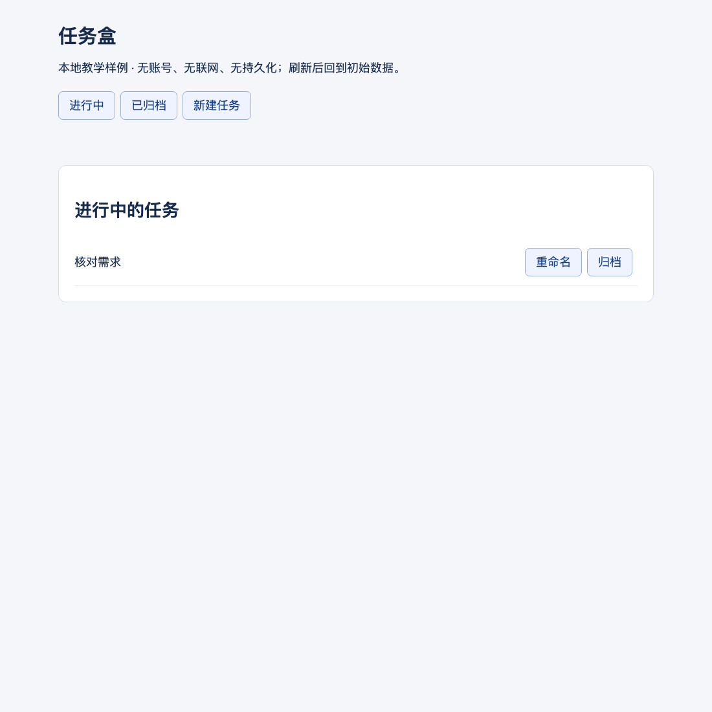
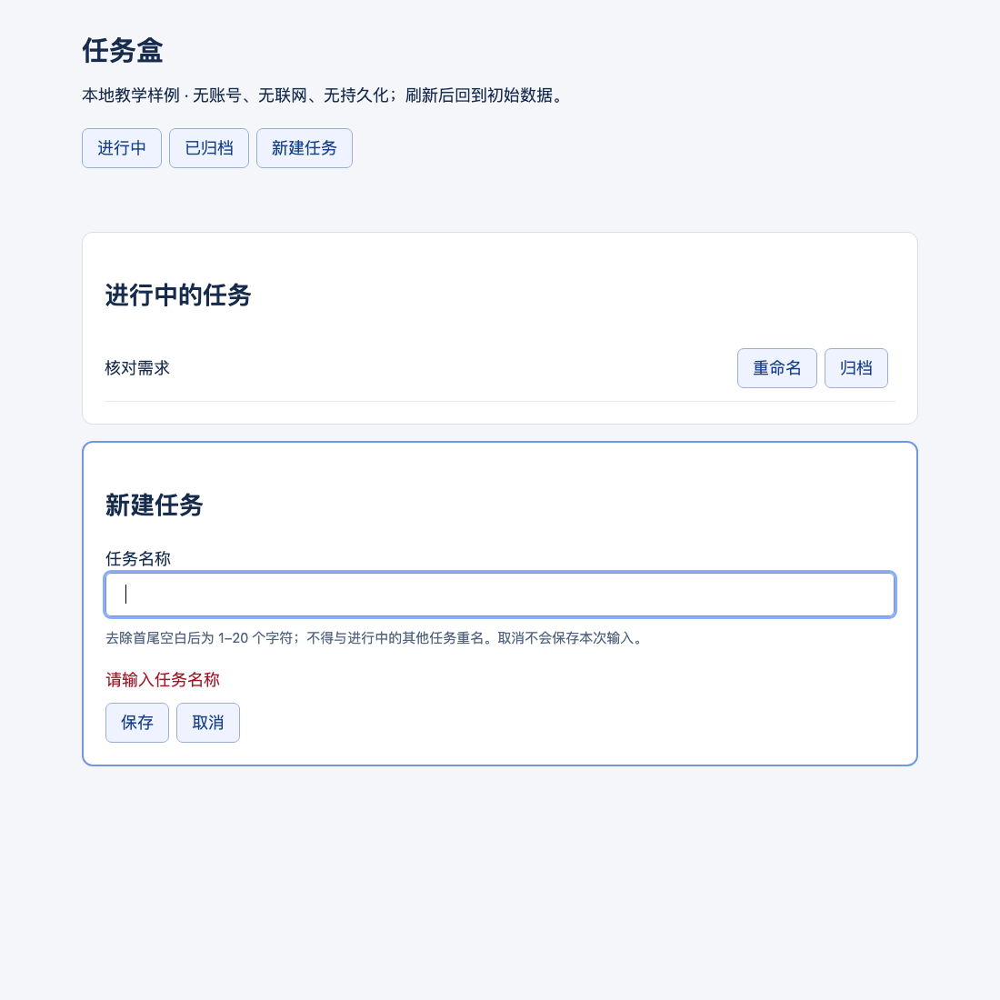
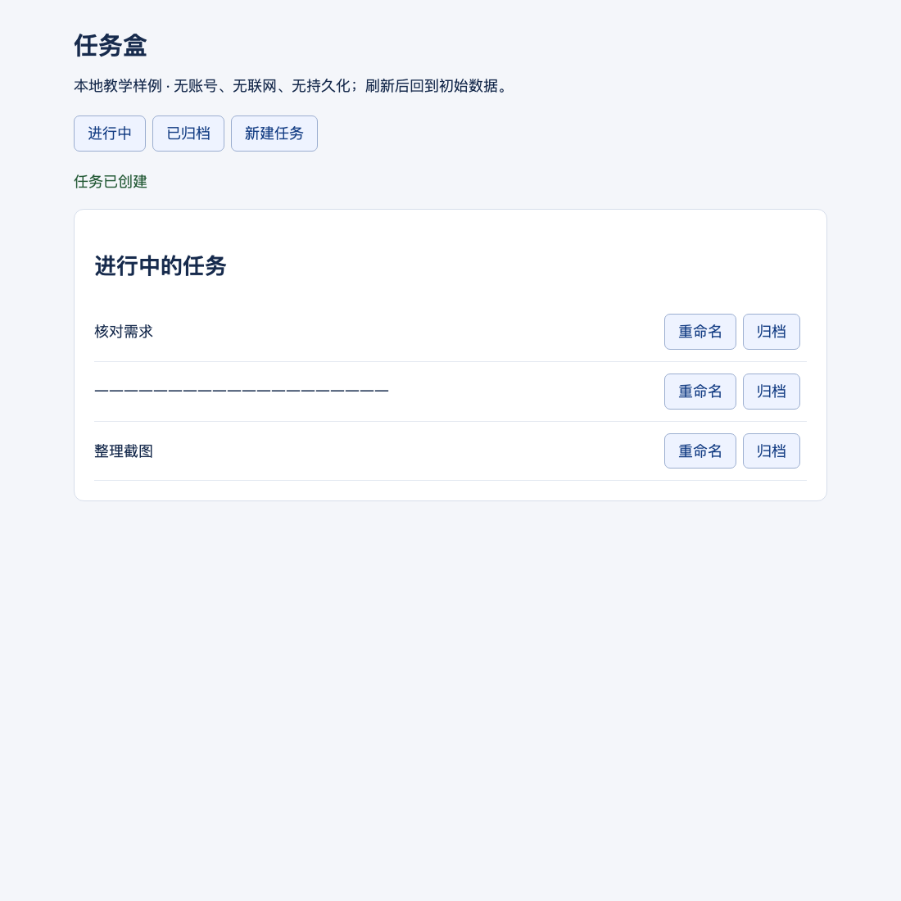
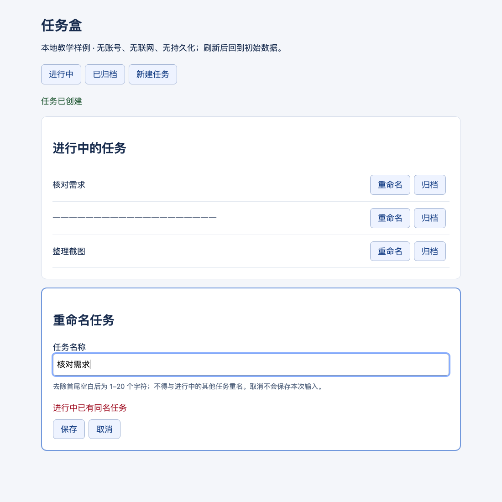
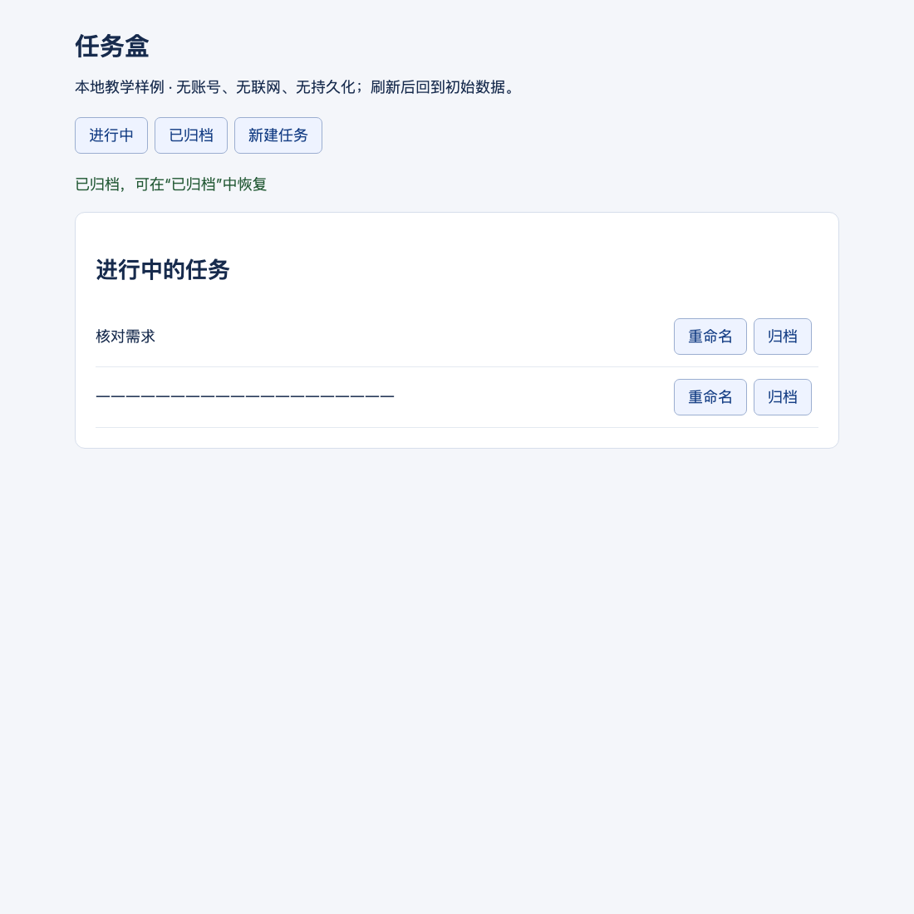
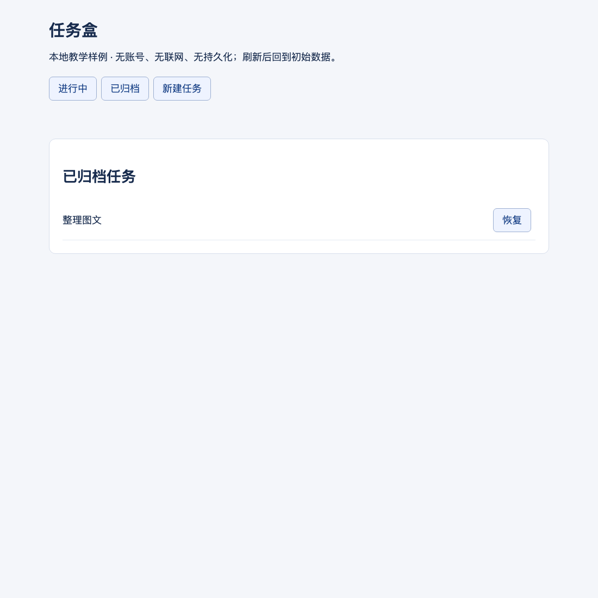
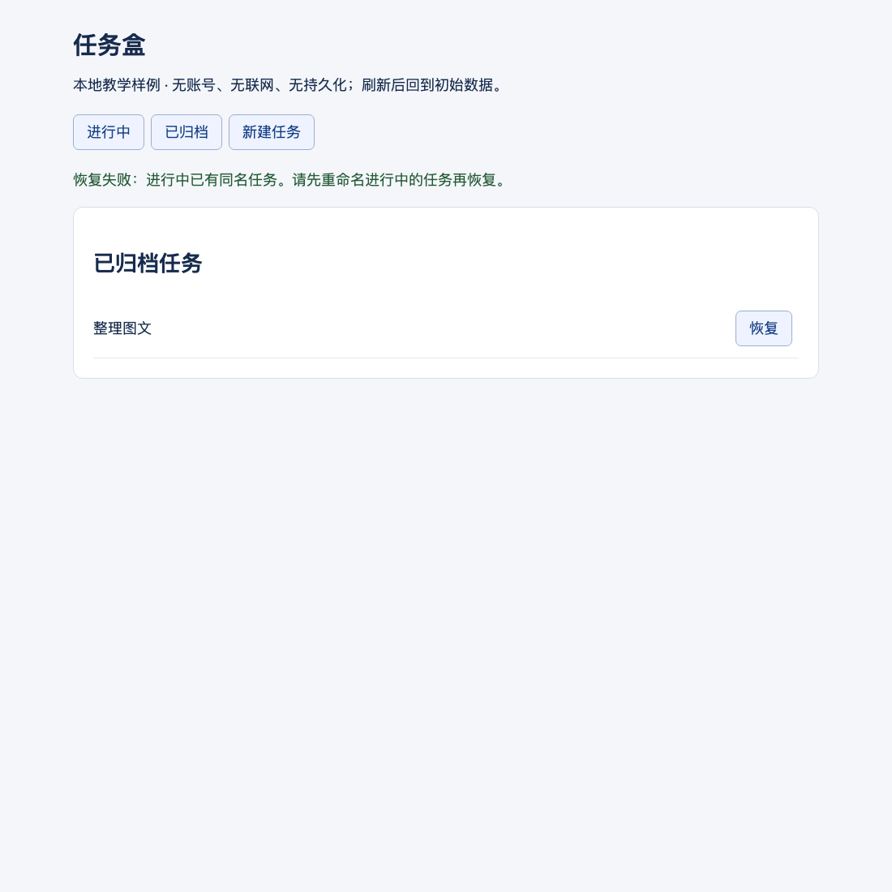
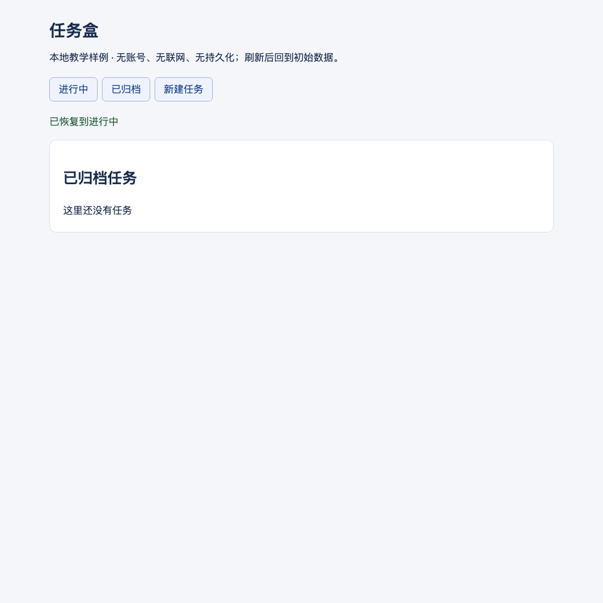
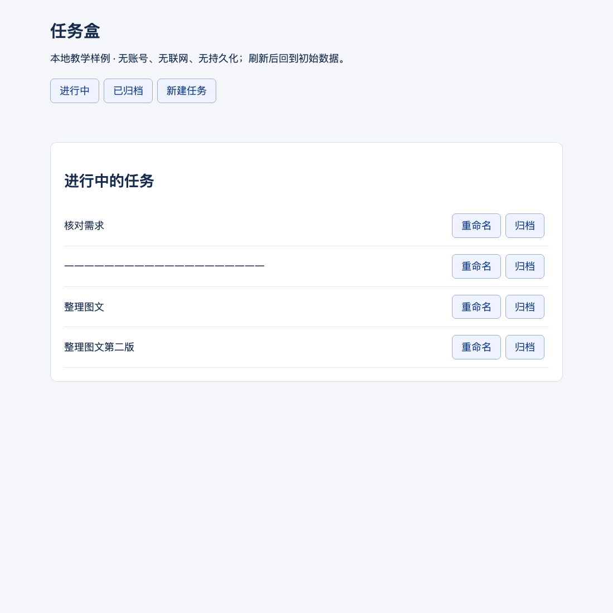

# 成稿样章：任务的创建、修改与归档恢复

这是一个完整功能域的写法示例，不是完整竞品报告，不替代原模板其他章节。研究对象是随仓分发的本地教学应用「任务盒」，不是商业产品。图均为该页面真实浏览器操作截图；不代表飞书/钉钉已发布，也不是我方设计稿。

## 读者先认识这个功能域

任务盒用于管理一份短任务列表。用户先创建任务，再修正任务名称；暂时不用的任务进入归档区，日后可以恢复。它把「不再显示」和「删除数据」区分开，但没有提供永久删除入口。我们只研究这个本地页面，不据此推断任何真实产品的完整功能。

首屏有「进行中」「已归档」「新建任务」三个入口，初始列表只有「核对需求」。进行中的每一行提供重命名和归档；归档区的每一行只提供恢复。新建入口在两类列表都可用，因此归档后出现的同名新任务会影响恢复结果。下文将这段跨功能关系讲清，而不把它拆成四个互不相关的按钮介绍。

图中只能证明首屏可见入口及初始状态，不能证明同步、多人协作、持久化或完整键盘支持。实测刷新后，后续新增和修改的数据全部消失，只剩初始任务；本页面适合教学，不适合作为真实任务存储工具。

## 功能全景与粒度

| 功能域 | 最细行为 | 原生入口 | 结果边界 |
|---|---|---|---|
| 任务管理 | AF-001 创建任务 | 任一列表 → 新建任务 | 新增一条进行中任务 |
| 任务管理 | AF-002 重命名任务 | 进行中 → 任务行 → 重命名 | 同一任务名称改变，不新增记录 |
| 任务管理 | AF-003 归档任务 | 进行中 → 任务行 → 归档 | 原任务离开进行中、进入已归档 |
| 任务管理 | AF-004 恢复任务 | 已归档 → 任务行 → 恢复 | 原任务重新进入进行中；同名冲突时不迁移 |
| 任务管理 | AF-005 查看与切换列表 | 顶部 → 进行中 / 已归档 | 改变展示集合及可用操作，不改变任务归属 |

这里两层足以到达可独立验收行为。必填检查、输入超长和取消是对应行为的分支，不另算三个功能；「任务管理」也不能作为一个叶子覆盖全部细节。

## AF-001：创建任务

用户在任一列表点击「新建任务」，列表下方出现名称编辑区，输入框初始为空。创建不会要求登录或选择负责人；这是无账号的教学页面，不代表其支持匿名云端协作。

保存前会去除名称首尾空白，去除后必须有 1–20 个字符，并且不得与进行中的任务同名。实测输入只有空白时显示「请输入任务名称」，21 个相同汉字显示超长错误，20 个通过；输入「 核对需求 」会因去空白后重名而失败。我们验证了这些汉字与空白输入，未把它扩大成全部 Unicode 组合均已验证。

失败发生在编辑区内，错误旁仍保留输入，列表不新增任务。用户可以直接修改并再次保存；点取消会丢弃本次输入，重新打开新建时输入框为空。实测保存「 整理截图 」后，编辑区关闭，回到进行中列表，新增的名称为「整理截图」，并出现「任务已创建」。

截图中另有一条由边界测试创建的 20 字任务，这是测试数据，不是分页或自动生成能力。对我方的启示是：需求不能只写「支持创建」；至少应决定名称规范、重名范围、失败保留、取消处理、成功落点以及是否持久化。当前页面无网络写入，不能据此陈述网络失败后的重试和去重策略。

## AF-002：重命名任务

重命名的普通入口仅在进行中列表提供。点任务行的「重命名」后，同一编辑区带入原名称；目标是修改已有任务，而不是复制一条任务。实测把「整理截图」改为另一条进行中任务的名称「核对需求」，保存失败，旧名称仍在列表中，尝试的新名称留在编辑区供修改。

重名检查排除当前任务自身：原样保存自己的名称可以成功。取消失败的修改再重新打开，输入框恢复为原名称，不带入先前失败的输入。改为「整理图文」后，任务条数不变、同一行显示新名称，编辑区关闭并显示「名称已更新」。

创建与重命名在源码中共用去空白、长度和同名检查；上述浏览器操作验证了重命名冲突、原名保存、取消和成功。我们没有把创建的全部长度用例说成又在重命名执行了一次。对我方的启示是，公共校验可以有唯一正本，但每个功能仍要交代其独有前置、成功结果与取消语义。

## AF-003：归档任务

用户在进行中任务行直接点「归档」，没有第二次确认。本次实测中，「整理图文」立即从进行中列表消失，页面提示可以到已归档中恢复。归档不是永久删除：切换到已归档后，原名称和恢复入口仍可见。

归档区不提供重命名，这个差异会直接影响下一节的冲突恢复路径。当前记录是页面内存数据，截图证明的是同一次会话中的迁移，不证明跨会话保留、审计留痕或服务器软删除。我方若借鉴免确认归档，需要同时设计可发现的恢复入口，并单独决定保存期限，不能从「有归档区」推断「永久可恢复」。

## AF-004：恢复任务

用户在已归档任务行点恢复。通常应将原任务搬回进行中，但本页面只约束进行中的名称唯一，允许新建与已归档任务同名的任务。我们先归档「整理图文」，再创建同名新任务，然后恢复旧任务，实际出现冲突，旧任务仍留在归档区，没有覆盖或合并新任务。

提示要求先重命名进行中的任务，而不是直接改归档任务。可行恢复路径是：切到进行中 → 把新任务改为「整理图文第二版」→ 回已归档 → 再恢复旧任务。成功后当前归档列表为空，提示「已恢复到进行中」，但不会自动切换列表；用户再点进行中才能看到恢复后的旧任务。

这个例子说明，只测正常路径会漏掉跨功能约束。对我方可提出改善建议：冲突提示中提供前往重命名的动作，减少来回寻找；但这只是建议，不是已实现事实，也不是已获批准的 PRD 要求。恢复的联网失败、并发冲突及跨账号权限均没有可执行环境，不能宣称通过。

## AF-005：查看与切换列表

用户通过顶部两个列表入口寻找目标任务，不需输入字段。查看是独立结果，不是把两个导航按钮凑成两个功能：进行中展示可改名/归档的任务，已归档展示可恢复的任务，切换不迁移任务本身。E13 与 E17 分别实测了切到归档和切回进行中；恢复最后一条归档后，E16 验证空列表显示“这里还没有任务”。进行中空列表使用同一渲染逻辑，但尚未单独实测。

源码显示切换列表会清空旧通知、关闭编辑区并丢弃未保存输入；这些编辑中切页的分支没有独立操作记录，不能冒充已测试。它提示我方需要明确导航时的草稿策略，而不只是画两个列表入口。还有一个待补测的交叉路径：归档按钮没有关闭编辑区，因此先打开重命名、再归档同一任务、继续保存，可能仍改到归档对象；这是源码推断，不把它直接定为实测缺陷。“归档列表无编辑入口”不等于“任何路径都无法编辑归档对象”。

## 端到端路径与消费检查

完整正常旅程为：新建 → 可见 → 重命名 → 归档 → 归档可见 → 恢复 → 进行中可见。冲突旅程在恢复处多出「回进行中改名」分支；取消新建不产生记录，取消重命名不改变原记录。该域的四项变更动作与列表查看由对象身份、名称占用范围和所在列表连接起来。

| 消费问题 | 成稿中的明确答案 | 证据 |
|---|---|---|
| 什么输入合法？ | AF-001：去首尾空白后非空、长度满足限制，进行中不重名 | E02–E04、E06–E07 |
| 重命名会不会复制？ | AF-002：任务数不变；原名保存允许 | E08–E11 |
| 归档是否删除？ | AF-003：同会话转入归档；不推断持久化 | E12–E13、E18 |
| 为什么恢复失败，怎样恢复？ | AF-004：同名占用，改进行中名称后重试 | E14–E17 |
| 哪些还不能支持决策？ | 全部持久化、网络、权限、性能与真实用户价值尚未验证 | 本地样例边界，不以缺环境推断产品缺能力 |

## 写法对照与证据入口

不合格写法：「支持任务管理，可新增、修改、归档与恢复，交互清晰，建议参考。」它没有合法输入、对象变化、恢复条件，也无法让设计或测试直接使用。上面的成稿不是靠固定四级目录或凑字数变详细，而是把每项行为与跨功能约束说清。

实测事件、断言、源码和图片摘要见 [evidence/evidence.json](evidence/evidence.json)。需要复现时，在本目录运行 `node capture.cjs --out <新的证据目录>`；它仅打开隔离的本地无头浏览器，复用套件 CDP 模块，不控制用户光标、不读取个人浏览器、不访问网络。生成后须对照新图检查正文；脚本通过不等于正文已获独立评审。正式报告使用现有截图清单/遍历事件模板，不将本例的精简实验记录冒充平台回执。

Markdown 图片是本地可读成稿的一部分；发布飞书或钉钉时，仍须走平台上传与同版回读，不能把这里的相对路径当成已上传图片实体。研究事实怎样转成我方决定，见 [PRD 切片](prd-slice.md)。
